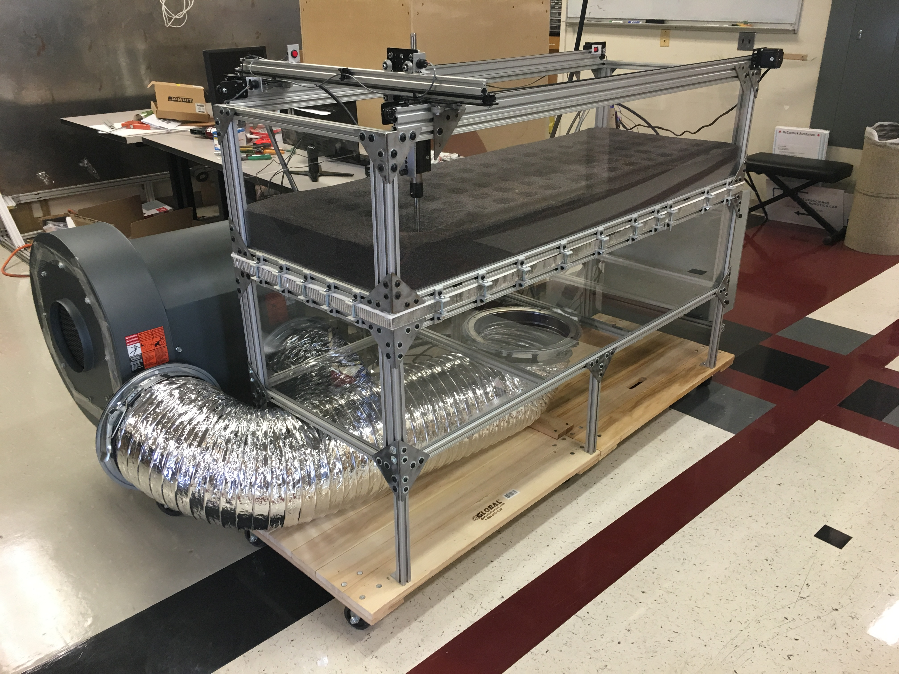
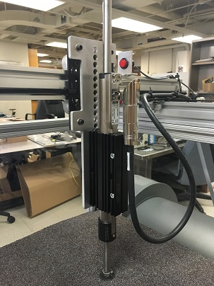
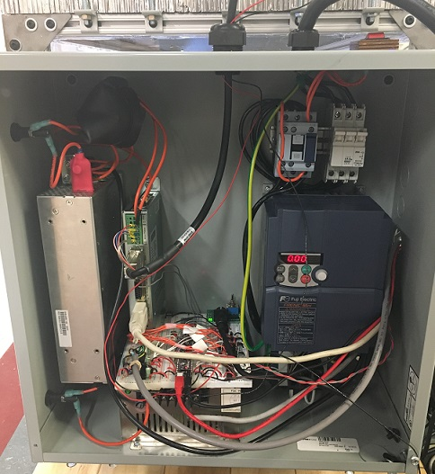

# Hopper_Robot #
This repository contains code being used to run the *Soft Ground Locomotion* project in the Neuroscience and Robotics Lab at Northwestern University.

## Project Description ##
Project aims to integrate physics models and control methodologies for enhanced robotic legged locomotion on yielding terrain. Currently, robotic performace on natural substrates such as sand, snow, and grass is limited. Mechanical reactions of the earth exibit great spatial variation, imposing challenges to robotic design and control. Legged robots with greater mobility on natural terrain have applications in many areas, including: search and rescue, agricultural, planetary and space exploration, etc. The funding for this project is provided by NASA through the National Science Foundation as a part of the National Robotics Initiative.

## Apparatus ##
The apparatus for this project collects data used to characterize the material response and will be used to test controllers and designs that take advantage of these material properies.

The apparatus consists of several components. The bed seen above is filled with a granular material (200 lbs of poppy seeds!). In order to *reset* the material between experiments, air is blown through the bottom of the bed using a blower. This air causes an increase in pressure which results in the [fluidization](https://en.wikipedia.org/wiki/Fluidization) of the material. The blower is then turned off at a fixed rate using a [variable frequency drive](https://en.wikipedia.org/wiki/Variable-frequency_drive). This allows the material to settle into a repeatable packing stage with a given packing fraction. The packing fraction is important in determining the properties of the bulk material.

Above the bed, there is a linear motor mounted to a gantry system. The linear motor is outfitted with an encoder and a 6-axis force/torque sensor. These sensors collect data as the linear motor is plunged into the granular material. They also allow the motor to track force or position trajectories by utalizing feedback control. Varying the velocity and/or desired forces during an intrusion results in different reponses from the material. These responses are being characterized and will be exploited to design robot controllers that adapt to the varying conditions beneath them.

The gantry system allows the linear motor to move in the X and Y directions along the bed. This motion is achieved through the use of stepper motors and a system of pulleys attached to the linear motor base. This flexibility drastically increases the rate of data collection by increasing the number of intrusions before needing to fluidize the granular material.

The gantry system also has additional benfits. It is being used to characterize the effect of one intrusion on another depending on their spatial separation. This data will be useful in optimizing the gait of a multiple legged robot.

## Code ##
This apparatus is primarily controlled by a PIC32 microcontroller that communicates with a MATLAB client over a serial connection. The PIC32 reads data from various sensors and interfaces with the linear motor/blower drivers. It also impliments the 2 KHz force/position feedback controllers that control the linear motor. Reference trajectories for the linear motor are generated in MATLAB and sent over the serial port to be stored on the PIC32. For data collection, a simple MATLAB script automates testing procedures.

To control the stepper motors used for the XY table, an Arduino was flashed with the G-Code interpreter [GRBL](https://github.com/grbl/grbl). G-Code commands are sent to the arduino via a serial port to direct the linear motor around the bed. The same MATLAB client is also used for this communication.

[PIC32 Code]()
[MATLAB Code]()

## Electronics ##
The majority of the electronics for the apparatus are contained within an electrical enclosure mounted to the bed. A PCB is currently being designed to replace the breadboard containing the electronics. The apparatus is described using two circuit diagrams:
* [Linear Motor Control Circuit](LinearMotorControl.pdf) 
* [Blower Control Circuit](BlowerControl).

